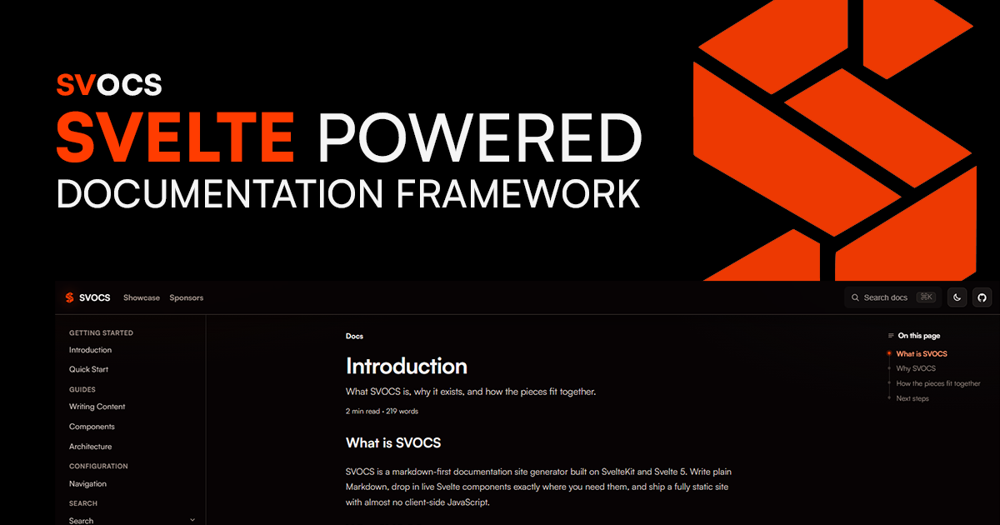

<p align="center">
  <a href="https://svocs.dev">
    
  </a>
</p>

# SVOCS

SVOCS is a markdown-first documentation site generator built on SvelteKit + Svelte 5.

## Current baseline

- SvelteKit app with TypeScript, ESLint, Prettier, Vitest, Playwright
- `mdsvex` support for `.md`/`.svx`
- Static site output via `@sveltejs/adapter-static`
- Pagefind-powered docs search index generated at build time
- Filesystem content in `content/`
- Docs route shell at `/docs/*` with sidebar navigation and `_meta.json` ordering support

## Project layout

```text
content/                 Markdown source files
src/lib/core/content.ts  Content registry + metadata extraction
src/routes/docs/         Docs layout and page rendering
```

## Commands

```sh
bun install
bun run dev
bun run check
bun run lint
bun run build
bun run search:index
bun run preview
```

## Package manager support

- Primary: Bun (`bun run <script>`)
- Also supported: pnpm (`pnpm <script>`)
- Also supported: Deno tasks (`deno task <task>` via [deno.json](deno.json))

Examples:

```sh
# pnpm
pnpm install
pnpm dev

# deno
deno task dev
deno task check
deno task build
deno task search:index
```

## Deployment

The build output in `build/` is fully static. Step-by-step guides live in the docs themselves:

- `content/deployment/cloudflare-pages.md` — Cloudflare Pages (zero config)
- `content/deployment/github-pages.md` — GitHub Pages via GitHub Actions

For sub-path hosts (GitHub Pages project sites), set `BASE_PATH` at build time:

```sh
BASE_PATH=/my-repo bun run build
```

## Notes

- Build output is static and written to `build/`.
- `mdsvex` currently emits Svelte 5 deprecation warnings for `context="module"` in generated markdown modules; this does not block builds.
