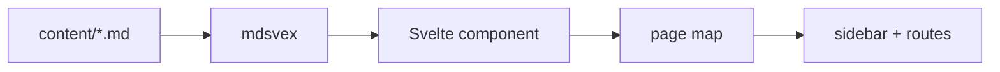

## Content pipeline

`Markdown -> transform -> compile -> page map`.

SVOCS currently uses mdsvex for markdown compilation and a small content registry for routing and sidebar navigation.

## Theme boundary

Themes render the page-map and content components. They do not own parsing or route generation.

## Routing

Docs are served from `/docs/*` via an optional catch-all route, and prerendered with `adapter-static`.

## Reading time

Every page's reading time comes from its word count, rounded up to whole minutes at a fixed 200 words-per-minute rate, with a one-minute floor for very short pages:

$$
t = \max\left(1, \left\lceil \frac{w}{200} \right\rceil\right)
$$

where $w$ is the page's word count (code fences excluded) and $t$ is the reading time shown in minutes.
