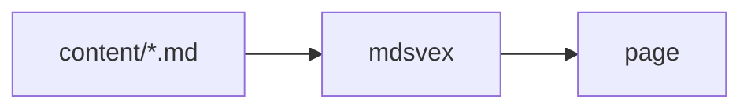

## Authoring model

Use plain markdown (`.md`) for most pages. Switch to `.svx` only when a page needs a live Svelte component inline — everything else about the two file types is identical: frontmatter, sidecars, GFM, code blocks.

## Frontmatter

Set page metadata directly in the file with YAML frontmatter — no sidecar file required:

```md filename="content/example.md"
---
title: Example Page
description: Shown in listings and the meta description tag.
order: 5
tags: [guide]
---

Your content starts here.
```

## Metadata fields

- `title`: Display title
- `description`: Optional summary for listings
- `order`: Sorting number for nav
- `tags`: Optional list for future filtering

## Sidecar overrides

A `name.meta.json` file next to `name.md` takes priority over frontmatter for any field it sets — useful when you want to tweak nav ordering without touching the prose file, or for content synced in from elsewhere:

```json filename="content/example.meta.json"
{
	"order": 1
}
```

Frontmatter still supplies everything the sidecar doesn't override. `_meta.json` — a separate, folder-level file — sits above both; see [Navigation](/docs/navigation) for how that precedence works.

## GFM formatting

Tables, task lists, strikethrough, and bare-URL autolinks all work out of the box:

| Feature       | Syntax         |
| ------------- | -------------- |
| Table         | pipe-delimited |
| Task list     | `- [ ] todo`   |
| Strikethrough | `~~done~~`     |

- [x] Ship GFM support
- [ ] Ship more of the roadmap

## Code blocks with a filename

Add `filename="..."` to a fence's info string to show a filename header above the code, alongside the built-in copy button every code block gets:

````md
```sh filename="deploy.sh"
echo hello
```
````

## Diagrams and math

Both render to static output at build time — no client-side JS ships for either, matching the rest of this project's "almost no JavaScript" approach.

Mermaid diagrams use a ` ```mermaid ` fence and render to inline SVG:

````md

````

Rendering a diagram needs a real browser at build time (Mermaid's layout engine runs in one, via Playwright) — run `npx playwright install chromium` once after `bun install` if `bun run build` fails looking for a browser. This isn't installed automatically, so a fresh scaffold that never uses diagrams doesn't pay for a ~100MB download it'll never need.

LaTeX math uses `$inline$` and `$$block$$` syntax, rendered via KaTeX:

```md
Inline: $E = mc^2$.

Block:

$$
t = \max\left(1, \left\lceil \frac{w}{200} \right\rceil\right)
$$
```

## Components

`.svx` files (not `.md`) can import and use Svelte components inline — see the [Components](/docs/components) page for the full built-in set (Callout, Tabs, Steps, Cards, Collapse, Bleed, Banner, FileTree, ImageZoom) and how to import them.

> **Watch out:** avoid writing a literal script-tag as inline code (single backticks) — unlike
> fenced code blocks, inline spans aren't protected from Svelte's own tag parsing and will break
> the build. Describe it in prose instead, or put it inside a fenced code block.
